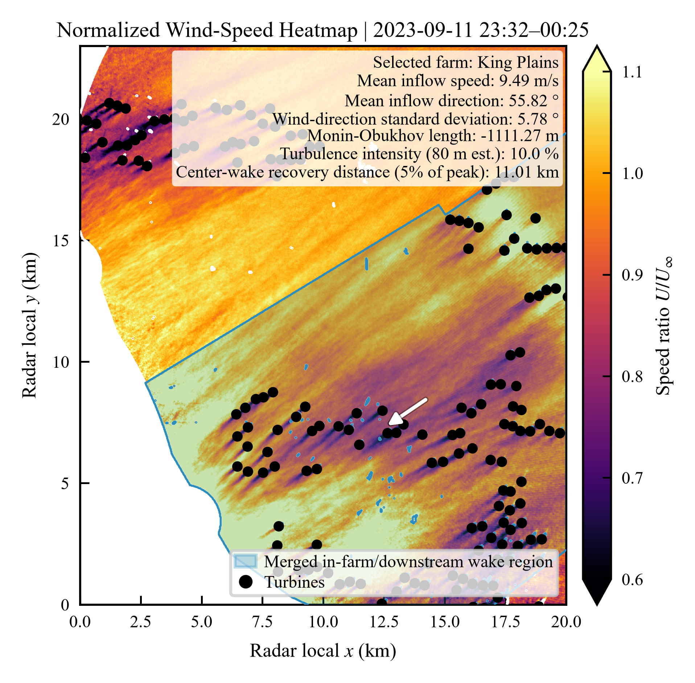

# AWAKEN validation

Fixed-parameter wake models compared with **35 corrected radar periods** and a **272-position turbine inventory**. Use the [shared environment](../README.md#one-environment-for-all-datasets), then run from the repository root:

```bash
python AWAKEN/main.py
```

This recalculates both top-down configurations and three engineering baselines, scores the new fields, and draws article Figs. 6–7. The 25 m illustrative case adds several minutes to the benchmark calculation. Use `--check-reference` to check publication predictions, `--reference` for a quick redraw from retained fields, or `--limit 1` for a short calculation check.

## Inputs and settings

The 35 NPZ files in `data/` retain radar observations, terrain-dependent observation heights, common masks, native and flow grids, turbine geometry, inflow/stability metadata, and reference predictions at their original precision. `data/turbines/` supplies the inventory and four proxy performance curves. Raw radar volumes and search caches are excluded.

`data/cluster_figure/` separately retains the selected Fig. 7 case's complete corrected radar footprint (`input.npz`), 25 m full-grid model predictions (`reference_25m.npz`; preceding 100 m fields in `reference.npz`), and the 18-case selection table (`case_selection.csv`). This extends the figure into farm interiors and between farms beyond the downstream scoring grid.

- Onshore top-down: H = 350 m, z0 = 0.01 m, recovery scale r = 9; parameters are defined by `AWAKEN_ONSHORE` in `../wake_models.py`.
- Original offshore-transfer top-down: H = 1000 m, z0 = 0.03 m, r = 1.
- Representative hub height: 85 m. The common hub-speed conversion retains z0 = 0.03 m, with case-specific L, direction, and observation-height projection.
- Gaussian and TurboPark: TI = 0.09. The Array-stability adapter uses an 85 m representative layer and D = 110 m with type-specific CT area scaling, then drives TurboPark with spatial inflow.
- Field scores use identical observation support, 0 < downstream distance ≤ 8 km. Errors are reported as a percentage of background reference speed (%); stored native coordinates are km and solver coordinates are m.

`main.py` runs the fixed settings; `models.py` contains geometry, sampling, and solver adapters. `no_wake` and `td_date_cv` remain retained scoring references. The compact workflow does not rerun parameter search or cross-validation.

## Results



*AWAKEN dual-Doppler radar ensemble average.*

| Model/configuration | Field MAE (%), 35 periods | Lateral-mean MAE (%), 23 periods |
|---|---:|---:|
| Onshore top-down | 8.4581 | 6.1088 |
| Original offshore-transfer top-down | 10.4353 | 9.0509 |
| TurboPark | 8.5658 | 4.6684 |
| Gaussian | 8.9215 | 6.3478 |
| Array-stability + TurboPark | 9.7099 | 6.7432 |
| No wake | 10.5286 | 9.0889 |

Periods have equal weight; profile scores require sufficient common coverage. The onshore settings were developed on this benchmark, with exploratory internal validation. Use the generated paired intervals alongside mean scores when interpreting differences.

## Generated files

- `outputs/fields/*.npz`: new model fields and their processed observations.
- `outputs/metrics.csv`, `metrics_summary.csv`: per-period and ensemble errors.
- `outputs/figures/awaken_context_and_scores.{pdf,png,svg}`: Fig. 6, sampling context and ensemble comparison.
- `outputs/figures/awaken_representative_comparison.{pdf,png,svg}`: Fig. 7, six radar/model field panels (a)-(f).
- `outputs/tables/`, `outputs/figure_data/`: score tables, paired date-block intervals, plotted data, and the figure-selection record.
- `outputs/verification.json`: reference differences and diagnostic elapsed times.

`plotting.py` contains `summarize()`, `context()`, and `representative()`, with Fig. 7 delegated to `cluster_figure.py`. Full runs also recalculate the selected complete footprint; `--reference` uses its retained predictions. A limited run skips the publication figures. `assets/` preserves the submitted PDFs and previews.

Fig. 7 selects `split_551` (11 September 2023, King Plains target) from the 18 multi-farm periods. Eligible cases have observations within 500 m of at least three turbines at each of at least two farms, and top-down downstream MAE below all three engineering baselines. Selection then minimizes top-down MAE on the full terrain-supported native observation footprint on the original 100 m selection grid (6.0521%; ties by case ID). All panels cover −7.3 to 14.4 km from the target exit, retaining all common observations at ≥60% temporal coverage. The displayed 25 m wind-aligned grid gives top-down MAE 6.0066%, compared with Gaussian 6.3367%, TurboPark 6.4540% and ASM + TurboPark 6.4762%. These are expanded-domain case scores; the 35-period benchmark above retains its fixed scoring domain.

The 2026-09-16 revision removes panel (g) and the observed-width strip. Numerical lateral-mean diagnostics remain archived, and interpolation never enters scores. All Fig. 7 titles use Times New Roman, which must be installed.

The figure title reports wind speed (7.78 m/s), wind direction (64.6 degrees, meteorological from convention), and Monin-Obukhov length (-269.8 m). The internal case ID remains in the data provenance. The arrow in panel (a) points right along the positive streamwise coordinate, corresponding to a geographical flow-to bearing of 244.6 degrees.

To recalculate just Fig. 7, run `python AWAKEN/cluster_figure.py` from the OpenSource repository root; add `--reference` to redraw retained fields. The full research workspace's `workflow/scripts/build_awaken_cluster_case.py` regenerates the selection table and chosen input from the 18 complete radar fields.

Historical controlled timing data remain in `data/computational_cost.csv` and `data/timings.csv`. New execution times are diagnostics and do not repeat that benchmark protocol. Source mappings are in `data/provenance/compact_derivation.json`; the complete Fig. 7 input, predictions and file hashes are documented in `data/provenance/cluster_figure.json`. Campaign attribution is in [DATA_SOURCES.md](../DATA_SOURCES.md).

## Figure 7 resolution

Figure 7 now evaluates the models on the native 25 m radar grid (921 × 801) and uses a 25 m wind-aligned display grid (869 × 1153). Internal top-down/ASM grids remain 250 m. Heights are bilinearly interpolated from the retained 100 m height field; this adds no new terrain detail. The 35-period benchmark is unchanged.

Run `python AWAKEN/cluster_figure.py --check-reference` to recalculate and verify the 25 m figure. Use `--reference` for a quick redraw; `--resolution-m 100` reproduces the preceding version. In sequential single-thread measurements, five-model solve time increased from 23.65 s at 100 m to 298.84 s at 25 m (12.6×), excluding plotting. Predictions agree at all shared native sampling points. `data/cluster_figure/resolution_25m_*` preserves the comparison, timings, and provenance. Historical `_pp` field names retain the same `100 * ratio` values, now displayed with %.
