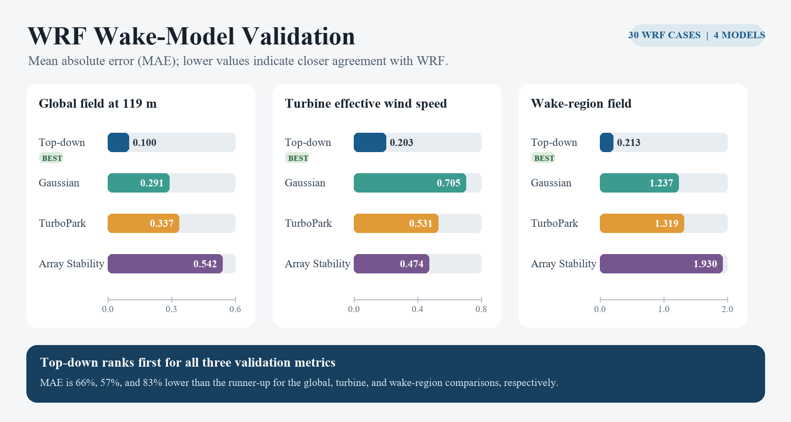
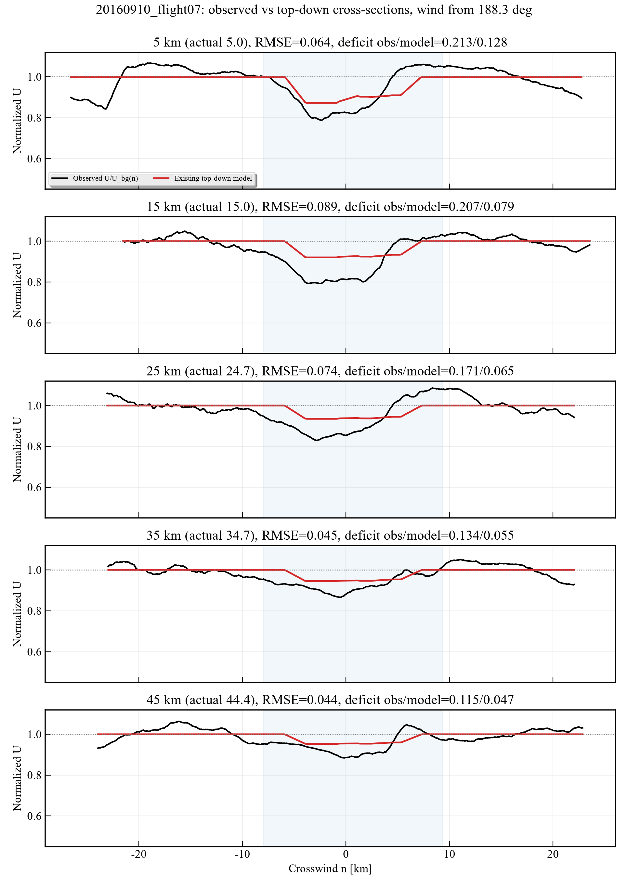
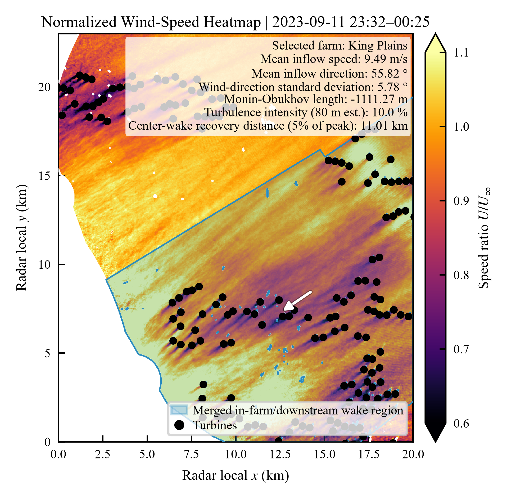

# Wind Cluster Wakes

Analytical modeling of wind-farm cluster wakes, centered on validation of the **improved Top-down model** against numerical simulations and field observations.

This is an actively developing research repository. WRF is the first integrated validation dataset; WIPAFF and AWAKEN will be added as separate validation workflows.

## Validation status

| Dataset | Reference | Current repository contents |
|---|---|---|
| [WRF](WRF_Validation/README.md) | Numerical wind-farm simulations | 30 processed cases, four model drivers, and a validation summary figure |
| WIPAFF | Airborne observations | Preview figure; dataset and validation workflow pending |
| AWAKEN | Doppler-radar observations | Preview figure; dataset and validation workflow pending |

## WRF validation results

The current comparison covers nominal wind speeds of **8, 10, and 12 m/s**, wind directions of **90° and 270°**, and five stability cases (**L = −500, −200, +200, +500 m, and neutral**) at a **119 m** reference height.



The supplied summary reports the following mean absolute errors (MAE, m/s); lower values indicate closer agreement with WRF.

| Model | Global field at 119 m | Turbine effective wind speed | Wake-region field |
|---|---:|---:|---:|
| **Improved Top-down** | **0.100** | **0.203** | **0.213** |
| Gaussian | 0.291 | 0.705 | 1.237 |
| TurboPark | 0.337 | 0.531 | 1.319 |
| Array Stability | 0.542 | 0.474 | 1.930 |

Improved Top-down has the lowest reported MAE in all three comparisons, approximately **66%, 57%, and 83%** below the next-best model for each metric, respectively. These findings apply to this 30-case WRF set. The values above are transcribed from the supplied figure; the metric aggregation script and exact wake-region mask are not yet included. See the [WRF documentation](WRF_Validation/README.md) for inputs, execution, and reproducibility details.

## Quick start

Run these commands from the repository root with Conda available:

```bash
conda env create -f environment.yml
conda activate pywake_cluster
python WRF_Validation/main_wrf_wake_models.py --limit 1
```

The smoke test runs one case through each of the four models. To run all 30 cases:

```bash
python WRF_Validation/main_wrf_wake_models.py
```

The shared [environment.yml](environment.yml) currently covers the WRF workflow. To update an existing environment:

```bash
conda env update -f environment.yml
```

Outputs are written under `WRF_Validation/outputs/` and ignored by Git. The drivers generate model predictions and case summaries; they do not regenerate the validation infographic above.

## Repository layout

```text
Wind Cluster Wakes/
├── README.md                  # Project overview and validation status
├── environment.yml            # Shared Conda environment
├── docs/images/               # Observational preview figures
└── WRF_Validation/
    ├── README.md              # WRF data, commands, and limitations
    ├── WRF_processed/         # 30 NPZ cases, manifest, turbine layout
    ├── assets/                # Curated validation summary figure
    ├── 10MW_turbine_curve.xlsx
    ├── main_wrf_wake_models.py
    ├── analytical_*.py        # Four model drivers
    ├── *_model.py             # Top-down and Array Stability formulations
    ├── wrf_*.py               # Shared loading, modeling, and plotting helpers
    └── outputs/               # Generated locally, ignored by Git
```

## Observational validation previews

### WIPAFF airborne observations



Crosswind profiles from 5 to 45 km downstream compare observed normalized wind speed with an existing top-down model. This retained preview is context for the planned WIPAFF integration; it is not presented as a completed validation of the improved model.

### AWAKEN Doppler-radar observations



The retained King Plains radar preview shows the observed wake region and turbine layout. Terrain effects significantly influence the wakes. The corresponding dataset and executable validation workflow are pending integration.

## Development conventions and next steps

- Keep each dataset in its own validation directory, with a README describing provenance, preprocessing, units, case coverage, and run commands.
- Maintain shared dependencies in the root `environment.yml`; add dependencies as new workflows are integrated.
- Keep compact inputs, manifests, and selected result figures under version control. Store routine generated outputs in each validation directory's ignored `outputs/` folder.
- For model changes, run the one-case smoke test, then the full affected validation set before updating reported results. Record the code revision, environment, parameters, and case selection with each result release.
- Next: add the WRF metric aggregation workflow and explicit evaluation masks, then integrate WIPAFF and AWAKEN datasets and validation drivers. Add dataset source references and reuse terms as part of that work.
