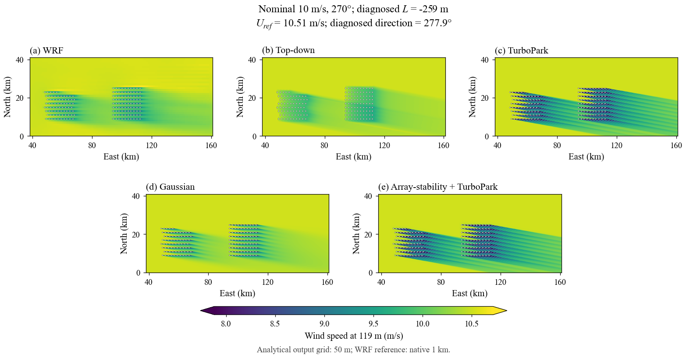
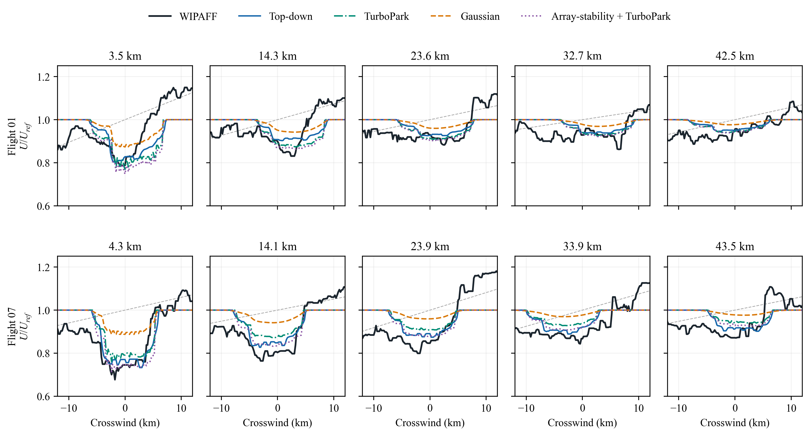
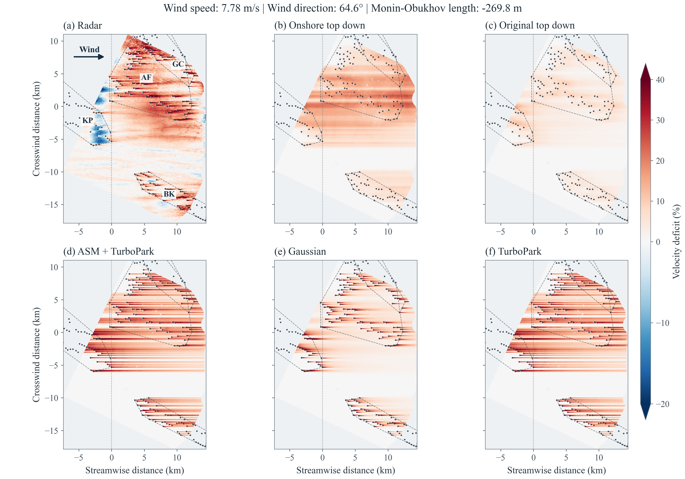

# Wind Cluster Wakes

**From wind-farm layout to long-distance wake predictions.** Compare a layout-aware top-down model with TurboPark, Gaussian, and Array-stability + TurboPark using WRF simulations, WIPAFF aircraft measurements, and AWAKEN Doppler-radar observations.

This repository contains the processed inputs and code for the manuscript *Analytical Modeling and Field Validation of Long-Distance Inter-Farm Wakes in Wind Farm Clusters* (8 October 2026 revision). **Each dataset has one `main.py`: calculate the models, compare with observations, and generate the paper figures.**

## Results at a glance

### WRF · flow fields across a wind-farm cluster

30 cases, 165 turbines, and four analytical models. Top-down achieves a mean wake-region MAE of **0.201 m/s**. Figure 3 uses 50 m analytical output in five panels (3+2), while the WRF reference remains at 1 km; nominal neutral refers to its case label, while the calculation uses diagnosed stability.



[WRF settings, results, and outputs →](WRF/README.md)

### WIPAFF · aircraft profiles through offshore wakes

Two flights, ten downstream transects, and 208 turbines. The mean section RMSE is **0.07335 U/Uref** for top-down. Scores use unsmoothed profiles; the displayed curves use the same five-bin median for observations and every model.



[WIPAFF settings, results, and outputs →](WIPAFF/README.md)

### AWAKEN · radar observations of onshore wakes

35 corrected radar periods and 272 supplied turbine positions. The onshore top-down configuration gives a mean field MAE of **8.458%**. The illustration below uses the favorable multi-farm case `split_551`, covering farm interiors and regions between farms across the maximum available radar footprint on a 25 m output/display grid (Figure 7). The ensemble scores and paired intervals are generated separately in Fig. 6. Onshore parameters were developed on this benchmark, so the full-sample result is not independent external validation.



[AWAKEN settings, results, and outputs →](AWAKEN/README.md)

## One environment for all datasets

From this directory, create and activate the shared environment:

```bash
conda env create -f environment.yml
conda activate pywake_cluster
```

Then run any or all of the three entrypoints:

```bash
python WRF/main.py
python WIPAFF/main.py
python AWAKEN/main.py
```

Each command recalculates all supplied cases and writes new predictions, CSV scores, and PDF/PNG/SVG figures to its dataset's `outputs/` directory. The finer illustrative grids add several minutes; runtime depends on the machine. Results and figures use the newly calculated predictions.

- Add `--check-reference` to check numerical agreement with the retained publication predictions (`rtol=atol=1e-10`). Omit this option when changing model parameters.
- Add `--reference` to quickly regenerate scores and figures from retained predictions without recalculating the solvers.
- WRF and AWAKEN accept `--limit 1` for a short calculation check. Paper figures requiring the complete ensemble are generated by a full run.

For an existing environment, run `conda env update -f environment.yml`. [environment.yml](environment.yml) is the only configuration file. Activate it before invoking Python, especially on Windows. Inputs are included; no raw-data download is needed. Plots use Times New Roman when installed, with DejaVu Serif as a fallback.


## Code layout

```text
OpenSource/
├── README.md
├── environment.yml       # Shared environment
├── wake_models.py        # Shared physical models
├── plot_style.py         # Shared fonts
├── WRF/
├── WIPAFF/
└── AWAKEN/
    # Each dataset has the same structure:
    ├── README.md         # Settings and results
    ├── main.py           # Calculate → compare → plot
    ├── models.py         # Dataset-specific solver adapters
    ├── plotting.py       # Publication plotting functions
    ├── data/             # Processed inputs and reference predictions
    └── assets/           # Paper figure PDFs and README previews
```

The three dataset entrypoints also call separate single-case illustration workflows for Figures 3 and 7. Keep the three dataset folders and the two shared Python files together. Raw-data processing, parameter searches, historical drivers, and duplicate model packages are outside this distribution.

## Figures and attribution

[FIGURE_INDEX.md](FIGURE_INDEX.md) maps paper Figs. 3–7 to their plotting files. All three `main.py` commands preserve `data/` and `assets/`; new output goes to `outputs/`.

See [DATA_SOURCES.md](DATA_SOURCES.md) for campaign references and input provenance. No project-wide source-code license was supplied with the workspace; existing dataset attribution is retained.

Project: [yangmingmei/Wind-Cluster-Wakes](https://github.com/yangmingmei/Wind-Cluster-Wakes).

## Updated single-case figures (8 October 2026)

```bash
python WRF/cluster_figure.py --reference
python AWAKEN/cluster_figure.py --reference
```

Omit `--reference` to recalculate only the selected case; add `--check-reference` to verify a new calculation against the retained fine-grid fields. Figure 3 uses 50 m analytical output with 250 m top-down/ASM internal grids. Figure 7 uses 25 m native output and display grids, 250 m internal grids, and bilinear sampling of the existing 100 m height field.

In the preceding sequential single-thread measurements, WRF four-model solve time increased from 156 s at 100 m to 638 s at 50 m (4.1×); AWAKEN five-model solve time increased from 23.65 s at 100 m to 298.84 s at 25 m (12.6×). These are single-case measurements, excluding plotting, rather than hardware-independent benchmarks. The 30-case WRF and 35-period AWAKEN aggregate scores retain their original scoring grids.

Wind-speed labels use m/s. Normalized deficit/error labels use % with the existing numerical scale, `100 * ratio`; historical CSV/NPZ keys ending in `_pp` are retained for compatibility.
