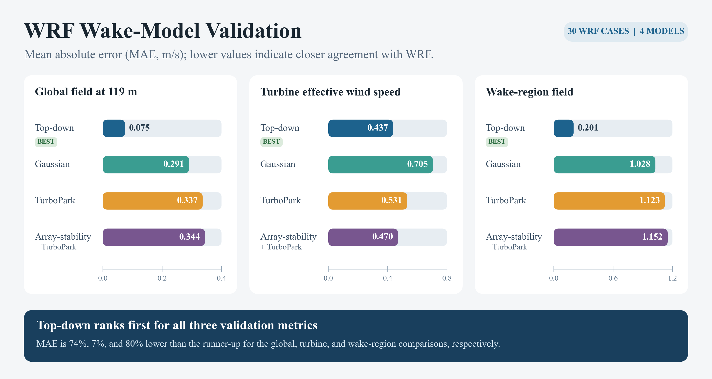

# WRF validation

Four wake models compared with **30 processed WRF states**, covering 165 turbines at 119 m on a 1 km reference grid. Use the [shared environment](../README.md#one-environment-for-all-datasets), then run from the repository root:

```bash
python WRF/main.py
```

This recalculates all four models, scores the new fields and turbine speeds, and generates article Fig. 3. Use `--check-reference` to assert agreement with publication predictions, `--reference` for a quick redraw from retained predictions, or `--limit 1` for a short calculation check.

## Inputs and settings

`data/` contains 30 NPZ files and `10MW_turbine_curve.xlsx`. Each NPZ combines the WRF reference field, grid, turbine positions, diagnosed inflow/stability, boundary-layer height, and four reference predictions. Original numerical precision is preserved.

- Nominal cases: 8/10/12 m/s, 90°/270°, and L labels −500/−200/+200/+500 m/neutral. Solvers use the retained diagnosed inflow and L. The central nominal-neutral case has diagnosed L ≈ −259 m.
- Top-down: z0 = 0.0002 m, case-specific H and L, 250 m internal grid, CT scale 1, and array support radius `spacing / sqrt(2)`.
- Gaussian expansion coefficient: 0.0324555. Engineering-model ambient TI: 0.09.
- Array-stability: 20 CT iterations, tolerance 1e-4, sigma-x = 9D, sigma-y = 3D, skewness 2.

Case execution settings are in `main.py`; numerical adapters are in `models.py`, with shared physics in `../wake_models.py`. No raw `wrfout` input or WRF integration is required.

## Results



*Mean absolute errors across 30 WRF cases (equal case weighting; lower is better).*

| Model | Wake MAE (m/s) | Full-grid MAE (m/s) | Turbine MAE (m/s) |
|---|---:|---:|---:|
| Top-down | 0.200672 | 0.074681 | 0.436916 |
| TurboPark | 1.122926 | 0.336543 | 0.531417 |
| Gaussian | 1.027709 | 0.290643 | 0.705179 |
| Array-stability + TurboPark | 1.152381 | 0.344294 | 0.469776 |

Cases have equal weight. The common wake mask is `Uref − Uwrf >= max(0.05 m/s, 0.02 Uref)`. Turbine errors use WRF values at the supplied turbine indices.

## Generated files

- `outputs/fields/*.npz`: new model fields and turbine speeds.
- `outputs/metrics_by_case.csv`, `metrics_summary.csv`: per-case and ensemble scores.
- `outputs/figures/wrf_model_heatmap.{pdf,png,svg}`: Fig. 3, drawn by `plotting.py::make_figures` from the new predictions for `ws10_wd270_Lmneutral`.
- `outputs/figure_data/wrf_heatmap.npz`: plotted numerical fields.
- `outputs/verification.json`: reference differences and diagnostic calculation times.

The fixed Fig. 3 case must be included to draw the figure; use the default full run. `assets/` preserves the submitted PDF and its preview.
